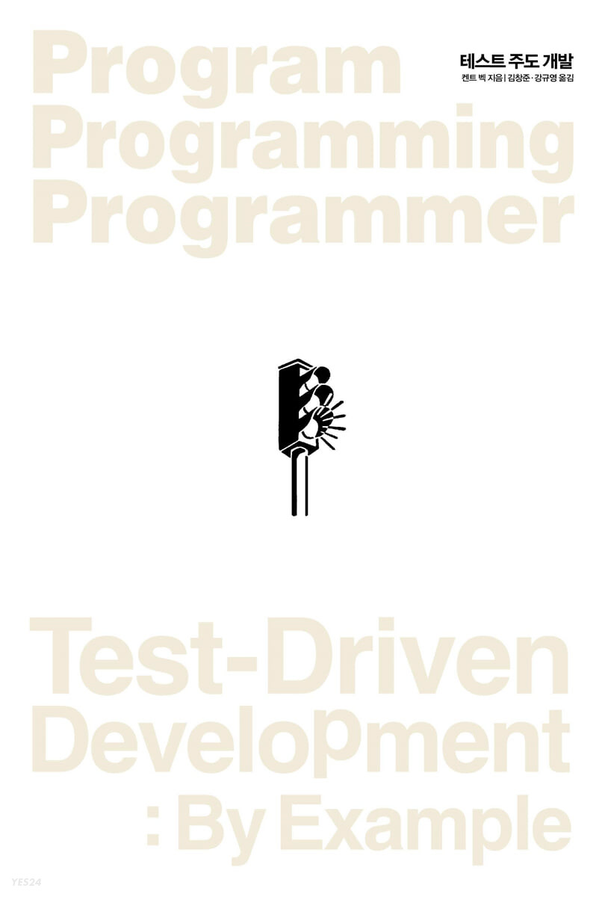
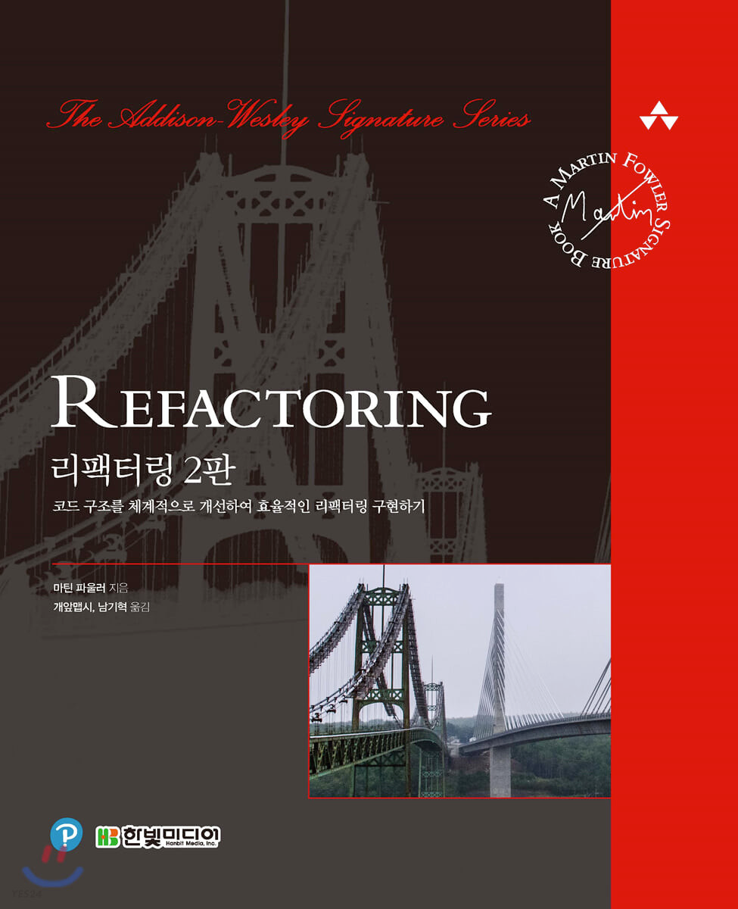
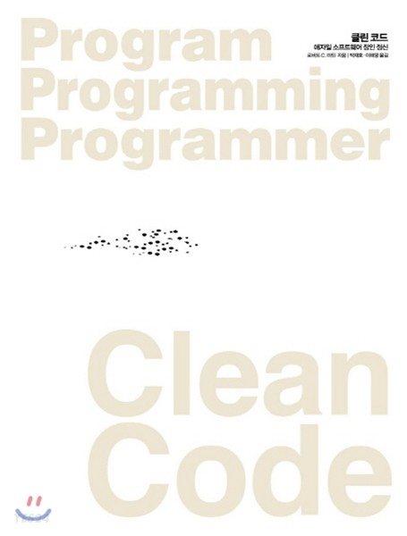
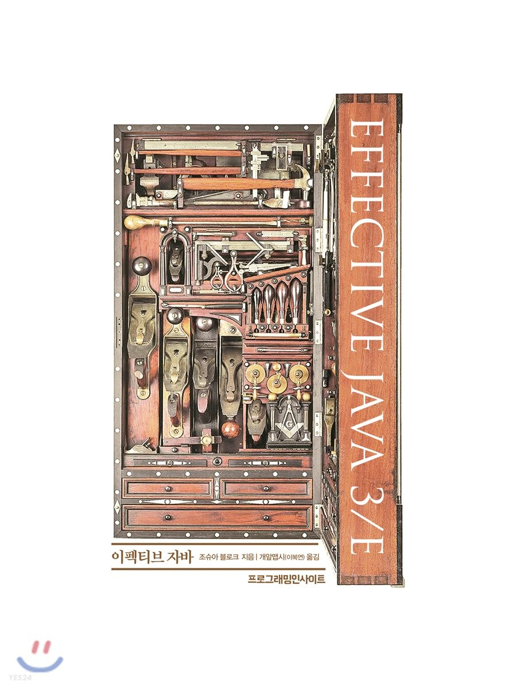
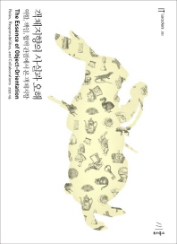
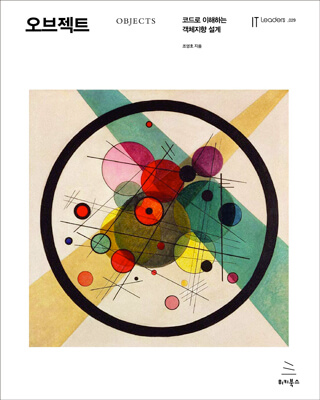
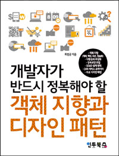
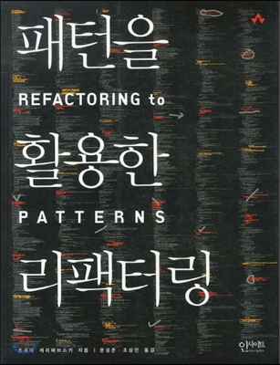
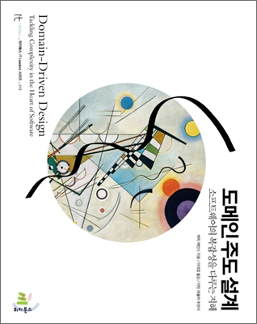

# 개발자를 흔들어 깨우기 위한 필독서 리스트(Back-end / 객체지향 언어 위주)

----
## TDD, 리팩터링, 클린코드, 객체지향 학습 로드맵

### Test Driven Development by example - Kent Beck
- TDD의 구체적 사례와 패턴 제시
- TDD를 제대로 연습하고 경험하고 싶다면 반드시 읽고 실습해 봐야할 책
- `테스트 주도 개발(인사이트)` 이라는 이름으로 번역서가 존재      
  

### Refactoring(Improving the Design of Existing) - Martin Fowler
- 리팩터링 개념, 리팩터링이 필요한 이유와 다양한 리팩터링 카탈로그를 제공하고 있다.
- 책의 카탈로그가 나오기 전까지가 핵심적인 내용이다. 카탈로그는 필요한 시점에 참고하는 용도로 사용한다.
- `리팩터링(한빛미디어)` 이라는 이름으로 번역서가 존재  

### Clean Code - Robert C. Martin
- 클린 코드를 구현하기 위한 다양한 규칙들을 설명하고 있다. 책 예제 코드가 자바 기반으로 구현되어 있으며, 다양한 예제를 통해 설명하고 있다
- 클린 코드에 관심이 있는 개발자라면 반드시 읽어야 할 책이다.
- `Clean Code(인사이트)` 라는 이름으로 번역서가 있음  

### Effective Java 3/E - Joshua J. Bloch
- 자바 프로그래밍하면서 참고할 다양한 모범 사례를 볼 수 있다.
- 특히, 모던 자바가 여러 패러다임을 지원하면서 모범 사례에 대한 중요성은 더 높아졌다.  

### 객체지향의 사실과 오해 - 조영호
- 객체지향의 핵심이라 할 수 있는 역할, 책임, 협력에 대해 쉽게 설명하고 있다.
- 객체지향 초보로서 개념적인 부분에 대해 관심이 있다면 읽어볼 것  

### 오브젝트 - 조영호
- `객체지향의 사실과 오해` 책이 이론적인 내용을 다루고 있다면, 이 책은 실 예제를 통해 객체 지향을 설명하고 있다.  

### 객체 지향과 디자인 패턴 - 최범균
- 실 예제를 통해 객체 지향 개념에 대해 전달하고 있다.
- `객체지향의 사실과 오해` 책이 이론적인 내용을 다루고 있다면, 이 책은 실 예제를 통해 객체지향과 디자인 패턴을 설명하고 있다.  

### Refactoring to Patterns - Joshua Kerievsky
- 리팩터링을 통해 점진적으로 디자인 패턴을 적용해보는 경험을 할 수 있다.
- 디자인 패턴부터 학습을 시작하기 보다 리팩터링을 하다보면 결과적으로 디자인 패턴이 적용되는 경험을 할 수 있다.
- `패턴을 활용한 리팩터링(인사이트)` 라는 이름으로 번역서가 있음   

### Growing Object-Oriented Software, Guided by Tests - Steve Freeman, Nat Pryce
- Acceptance Test, Unit Test 기반으로 점진적으로 애플리케이션을 개발하는 과정에 대해 다루고 있다.
- 웹 애플리케이션이 아닌 예제를 사용하고 있어 책을 읽고 웹 애플리케이션에 적용하는데 약간의 어려움이 있다.
- `테스트 주도 개발로 배우는 객체 지향 설계와 실천(인사이트)` 라는 이름으로 번역서가 있다.  

### Domain - Driven Design - Eric Evans
- 도메인 중심으로 설계하고 사고하는 접근 방법을 익힐 수 있는 책. 단, 추상화된 내용이 많아 난이도가 있다.
- `도메인 주도 개발(위키북스)` 이라는 이름으로 번역서가 있음.  

### DDD Start! - 최범균
- DDD 책이 추상적이라면 이 책이 좀 더 구체화 되어 있으며, 쉽게 풀어 설명하고 있다.  

--------
## Computer Science
### 데이터베이스 
- Real MySQL 1 
  - 구조와 개념에 관한 내용
- Real MySQL 2
  - 쿼리 작성 방법에 대한 내용

### 네트워크
- HTTP & Network : 그림으로 배우는 책으로 학습(영진닷컴)
  - HTTP 에 대한 전반적인 학습 가능
- HTTP 완벽 가이드 (인사이트)
  - HTTP의 끝판왕
- 성공과 실패를 결정하는 1%의 네트워크 원리(성안당)
  - 전문가 수준으로 학습하려면

### 운영체제, 컴퓨터 시스템 아키텍처
- Operating System Concepts 에센셜
- 밑바닥부터 만드는 컴퓨팅 시스템 불 논리부터 컴퓨터 아키텍처, 운영체제까지

### IT 인프라, 아키텍처
- IT 인프라 구조 : 그림으로 공부하는
  - 다양한 용어들과 그에 대한 설명이 좋음

-------

## 빌드, 배포 자동화 및 지속적 통합

### 지속적인 통합 : 소프트웨어 품질을 높이고 위험을 줄이기 (위키북스)
- 지속적 통합을 위해 필요한 도구와 환경에 대한 설명

### 신뢰할 수 있는 소프트웨어 출시 : 효과적이고 지속적인 소프트웨어 개발의 모든것
- 지속적 통합을 이룬 다음 지속적 배포를 위한 설명

-----

## 개발 문화, 프로세스, 개발자의 삶

### 익스트림 프로그래밍(인사이트)

### 린 소프트웨어 개발(인사이트)

